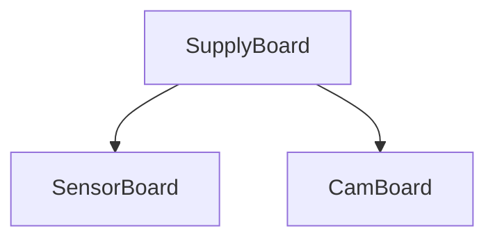

# Icaro Sensor Box

## Diseño

```mermaid
graph TD;
    SupplyBoard-->SensorBoard;
    SupplyBoard-->CamBoard;
```

## Módulos

- **Sensor Board** [**[+Info]**](../Modules/SensorBoard/Doc/sensorBoard.md): Tarjeta con los sensores básicos de telemetría.
