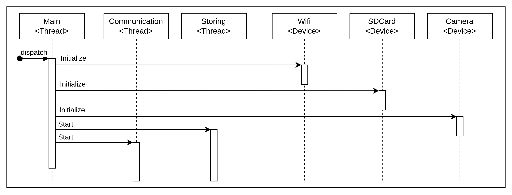
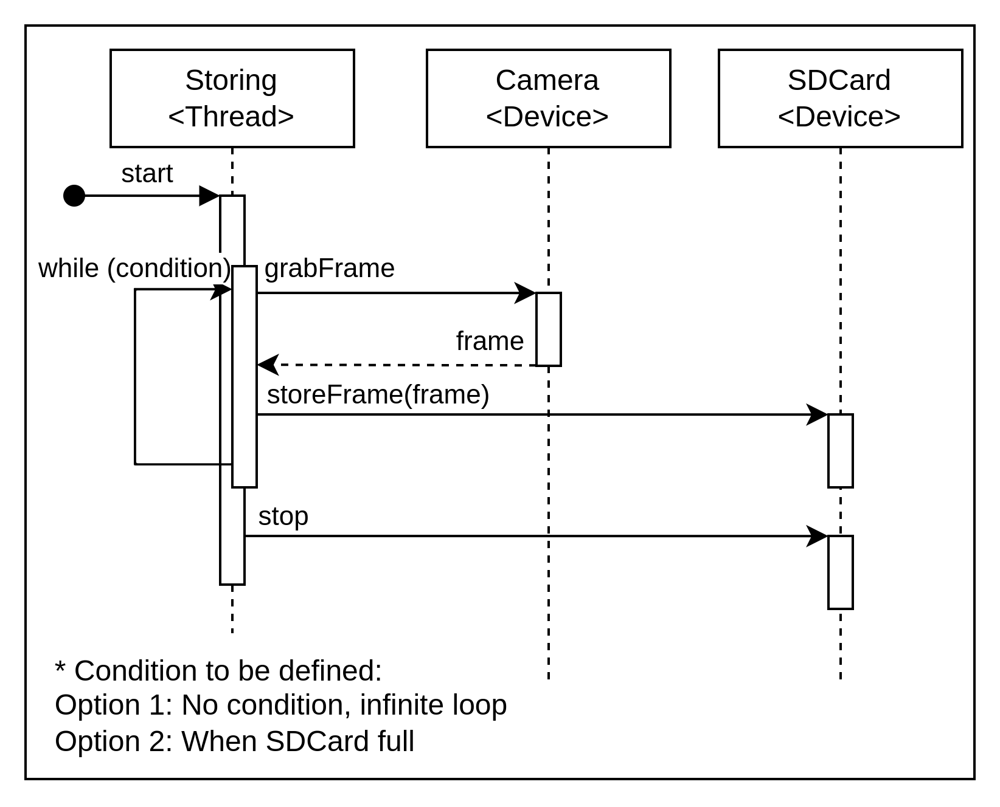
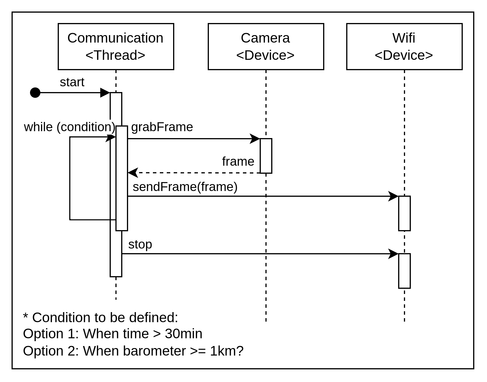

# Introduction

This component is part of the [Icaro project](https://github.com/LaboratorioGluon/Icaro) and is the camera module design to store and send images during the flight, it will also transmit the captured images to the ground station. 

# Setup

## Prerequisite: Install board file into Platformio

To create a project for the [board used](https://es.aliexpress.com/item/1005007544932625.html?spm=a2g0o.order_list.order_list_main.17.32df194d0UrpPI&gatewayAdapt=glo2esp) copy the [board file](./boardfiles/esp32-s3-devkitc-1-n16r8v.json) into the [Platformio boards directory](https://docs.platformio.org/en/latest/platforms/creating_board.html), then new projects may be created for this board by selecting "Espressif ESP32-S3-DevKitC-1-N16R8V (16 MB QD, 8MB PSRAM)".

## Interace configuration

The trasnmission protocol used is not standard and the WiFi interface must be preconfigured to receive the messages.

The interface shall be configured in monitor mode, to achieve this some scripts are available in the [scripts](./scripts/) directory:
1. [Show interfaces available](./scripts/00_showIfaces.sh)
   * Script to list available WiFi interfaces
1. [Initialize interface](./scripts/01_initIface.sh) (sudo required)
   * Script to configure the given interface to monitor mode 
1. [Deinitialize interface](./scripts/02_deinitIface.sh) (sudo required)
   * Script to restore the given interface to managed (normal) mode

Note: WiFi channel used in interface must be configured to match the one used by the ESP32 board (configured in code), Wireshark allows to change the channel of a WiFi interface. Got to 'View' menu and activate the 'Wireless Toolbar', select the used interface and select the used channel.

# Server tool scripts

There are a few tools available to help testing and development, these are python scripts located in the [scripts](./scripts/) directory:
* [Throughput analysis](./scripts/throughtputAnalyzer.py) (run with sudo)
   * Tool to see the packet per second receiving throughtput.
* [Image receiver/viewer](./scripts/imageReceiverESP.py) (run with sudo)
   * Tool to display the images and the FPS count received.

# SW Architecture

The software tasks are split into 1 initialization thread and 2 tasks:
1. Main App thread
   * This thread does the initial initialization for the application and the devices
   * Then it creates and starts the tasks

1. Image storing thread
   * This thread works in an infinite loop and does the following:
      * Read a frame from the camera
      * Stores the frame to the sd card

1. WiFi communication thread
   * This thread works in an infinite loop and does the following:
      * Read a frame from the camera
      * Sends the frame through the WiFi interface

