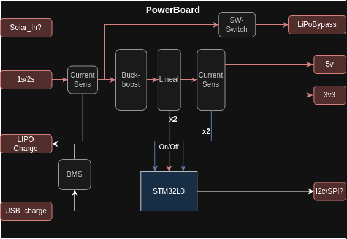

# Supply Board

Board responsible for adapting and distributing power to the rest of the boards.

## Functionality

The Supply Board must be capable of generating 5V and 3.3V from a 1S/2S battery input. Additionally, it must be able to turn on/off and measure the power consumption of each of its outputs.

## Main Components

- Processor: `STM32L031`
    - [Reference Manual](https://www.st.com/resource/en/reference_manual/rm0377-ultralowpower-stm32l0x1-advanced-armbased-32bit-mcus-stmicroelectronics.pdf)
    - [Datasheet](https://www.st.com/resource/en/datasheet/stm32l031e6.pdf)
- Buck-Boost Converter: `TPS63070`
    - [Datasheet](https://www.ti.com/lit/ds/symlink/tps63070.pdf?ts=1737812401667&ref_url=https%253A%252F%252Fwww.ti.com%252Fproduct%252Fes-mx%252FTPS63070)
- 3.3V Buck Converter: `TPS564257`
    - [Datasheet](https://www.ti.com/lit/ds/symlink/tps564257.pdf?ts=1742137228160&ref_url=https%253A%252F%252Fwww.ti.com%252Fproduct%252Fes-mx%252FTPS564257)
- Temperature Sensor: `TMP235A4DCKR`
    - [Datasheet](https://www.ti.com/lit/ds/symlink/tmp20.pdf)
- Current Sensor: `INA2180A4` (should be A1)
    - [Datasheet](https://www.ti.com/lit/ds/symlink/ina2180.pdf?ts=1738007939519&ref_url=https%253A%252F%252Fwww.ti.com%252Fproduct%252FINA2180)

## Specifications

## Design

## Interfaces

### Connectors

| ID   | Name                | Voltage         | Current | Connector             | Description                          |
|------|---------------------|-----------------|---------|------------------------|--------------------------------------|
| `J1` | `CI_BATT`           | `3.3 V - 15.0 V` | `2 A`   | XT-30                  | Battery input connector              |
| `J3` | `CIO_MAIN_CONNECTOR`| `-`             | `-`     | 02x12 Pin Header 2.54mm| Main connector to other boards       |

### Power Outputs

| Name        | Voltage         | Current     | Interface          | Description                         |
|-------------|-----------------|-------------|--------------------|-------------------------------------|
| `VI_BATT`   | `3.3 V - 15.0 V` | `2 A`       | `CI_BATT`          | Battery input connector             |
| `VI_USB`    | `5 V`           | `300 mA`    | `CI_USB`           | USB charging connector              |
| `VO_5V`     | `5 V`           | `1000 mA`   | `CIO_MAIN_CONNECTOR`| 5V output                          |
| `VO_3V3`    | `3.3 V`         | `1000 mA`   | `CIO_MAIN_CONNECTOR`| 3.3V output                        |
| `VO_BYPASS` | Same as `VI_BATT`| `2 A`      | `CIO_MAIN_CONNECTOR`| Power bypass output                |

### Signals

| Name                  | Voltage  | Interface           | Description                                                                 |
|-----------------------|----------|---------------------|-----------------------------------------------------------------------------|
| `CONTROL_ONOFF_BYPASS`| `3.3 V`  | `CIO_MAIN_CONNECTOR`| Control signal to turn on/off the `VO_BYPASS` output                        |
| `CONTROL_ONOFF_5V`    | `3.3 V`  | `CIO_MAIN_CONNECTOR`| Control signal to turn on/off the `VO_5V` output                            |
| `CURRENT_SENSI_BATT`  | Variable | `CIO_MAIN_CONNECTOR`| Voltage proportional to the current **entering** via `VI_BATT`             |
| `CURRENT_SENSE_BYPASS`| Variable | `CIO_MAIN_CONNECTOR`| Voltage proportional to the current **exiting** via `VO_BYPASS`            |
| `CURRENT_SENSE_5V`    | Variable | `CIO_MAIN_CONNECTOR`| Voltage proportional to the current **exiting** via `VO_5V`                |
| `CURRENT_SENSE_3V3`   | Variable | `CIO_MAIN_CONNECTOR`| Voltage proportional to the current **exiting** via `VO_3V3`               |
