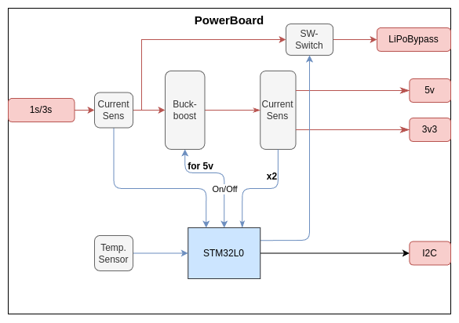

# Supply Board

Tarjeta encargada de adaptar y distribuir la potencia al resto de placas.

## Funcionalidades

La Supply Board tiene que ser capaz de a partir de el voltaje de una batería de 1S/2S generar 5V y 3V3, además de ser capaz de encender/apagar y medir el consumo en cada una de sus salidas.

## Componentes principales

- Procesador: `STM32L031`
    - [Reference Manual](https://www.st.com/resource/en/reference_manual/rm0377-ultralowpower-stm32l0x1-advanced-armbased-32bit-mcus-stmicroelectronics.pdf)
    - [Datasheet](https://www.st.com/resource/en/datasheet/stm32l031e6.pdf)
- Buck-Boost: `TPS63070`
    - [Datasheet](https://www.ti.com/lit/ds/symlink/tps63070.pdf?ts=1737812401667&ref_url=https%253A%252F%252Fwww.ti.com%252Fproduct%252Fes-mx%252FTPS63070)
- Buck converter para 3V3: `TPS564257`
    - [Datasheet](https://www.ti.com/lit/ds/symlink/tps564257.pdf?ts=1742137228160&ref_url=https%253A%252F%252Fwww.ti.com%252Fproduct%252Fes-mx%252FTPS564257)
- Sensor Temperatura: `TMP235A4DCKR`
    - [Datasheet](https://www.ti.com/lit/ds/symlink/tmp20.pdf)
- Sensor de Corriente: `INA2180A4` (Debería ser el A1)
    - [Datasheet](https://www.ti.com/lit/ds/symlink/ina2180.pdf?ts=1738007939519&ref_url=https%253A%252F%252Fwww.ti.com%252Fproduct%252FINA2180)
## Specificaciones

## Diseño

## Interfaces

### Conectores
| ID | Nombre | Voltaje | Corriente | Connector | Desc |
|-|-| :--: | :--: | :--: | - |
| `J1` | `CI_BATT` | `3.3 V - 15.0 V` | `2 A` | XT-30 | Connector de entrada de batería.|
| `J3` | `CIO_MAIN_CONNECTOR`| `-` | `-` | 02x12 Pin Header 2.54mm | Connector principal al resto de placas|

### Alimentaciones

| Nombre | Voltaje | Corriente | Interfaz | Desc |
|-| :--: | :--: | :--: | - |
| `VI_BATT` | `3.3 V - 15.0 V` | `2 A` | `CI_BATT` | Connector de entrada de batería.|
| `VI_USB` | `5 V` | `300 mA` | `CI_USB` | Conector de carga USB.
| `VO_5V` | `5 V` | `1000 mA`| `CIO_MAIN_CONNECTOR` | Salida de 5 V |
| `VO_3V3` | `3.3 V` | `1000 mA`| `CIO_MAIN_CONNECTOR` | Salida de 3.3 V |
| `VO_BYPASS` | Igual que `VI_BATT` | `2 A` | `CIO_MAIN_CONNECTOR` | Bypass de la alimentación |

### Señales 

| Nombre | Voltaje | Interfaz | Desc |
|-| :--: | :--: | :-- |
| `CONTROL_ONOFF_BYPASS` | `3.3 V` | `CIO_MAIN_CONNECTOR` | Señal de control para encender y apagar la salida `VO_BYPASS`. |
| `CONTROL_ONOFF_5V` | `3.3 V` |  `CIO_MAIN_CONNECTOR` | Señal de control para encender y apagar la salida `VO_5V`. |
| `CURRENT_SENSI_BATT` | `Variable` | `CIO_MAIN_CONNECTOR` | Voltaje dependiente de la corriente que **entra** por `VI_BATT`. |
| `CURRENT_SENSE_BYPASS` | `Variable` | `CIO_MAIN_CONNECTOR` | Voltaje dependiente de la corriente que **sale** por `VO_BYPASS`. |
| `CURRENT_SENSE_5V` | `Variable` | `CIO_MAIN_CONNECTOR` | Voltaje dependiente de la corriente que **sale** por `VO_5V`. |
| `CURRENT_SENSE_3V3` | `Variable` | `CIO_MAIN_CONNECTOR` | Voltaje dependiente de la corriente que **sale** por `VO_3V3`. |

### 