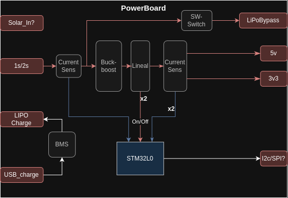

# Supply Board

Tarjeta encargada de adaptar y distribuir la potencia al resto de placas.

## Dudas

> ¿Habría que poner un uC para controlar todo en vez de sacar todos los pines? De esta manera solo sacamos un i2c o un spi al connector y listo.

He encontrado el STM32L031G6U6 en LCSC [[C96514]](https://www.lcsc.com/product-detail/Microcontrollers-MCU-MPU-SOC_STMicroelectronics-STM32L031G6U6_C96514.html?s_z=n_stm32l0). Un Cortex-M0+ por aprox 1€ la unidad. 

Otra alternativa sería un PY32 (chinorris) PY32F002 LCSC[[C7469099]](https://www.lcsc.com/product-detail/Microcontrollers-MCU-MPU-SOC_PUYA-PY32F002BF15U6TR_C7469099.html?s_z=n_py32). También Cortex-M0+

> Otra duda

## Funcionalidades

La Supply Board tiene que ser capaz de a partir de el voltaje de una batería de 1S/2S generar 5V y 3V3, además de ser capaz de encender/apagar y medir el consumo en cada una de sus salidas.

## Specificaciones

## Diseño

## Interfaces

### Conectores
| ID | Nombre | Voltaje | Corriente | Connector | Desc |
|-|-| :--: | :--: | :--: | - |
| `J1` | `CI_BATT` | `3.3 V - 9.0 V` | `2 A` | XT-30 | Connector de entrada de batería.|
| `J2` | `CI_USB` | `5 V` | `300 mA` | micro-USB | Conector de carga USB.
| `J3` | `CIO_MAIN_CONNECTOR`| `-` | `-` | 02x08 H2.0 | Connector principal al resto de placas|

### Alimentaciones

| Nombre | Voltaje | Corriente | Interfaz | Desc |
|-| :--: | :--: | :--: | - |
| `VI_BATT` | `3.3 V - 9.0 V` | `2 A` | `CI_BATT` | Connector de entrada de batería.|
| `VI_USB` | `5 V` | `300 mA` | `CI_USB` | Conector de carga USB.
| `VO_5V` | `5 V` | `500 mA`| `CIO_MAIN_CONNECTOR` | Salida de 5 V |
| `VO_3V3` | `3.3 V` | `500 mA`| `CIO_MAIN_CONNECTOR` | Salida de 3.3 V |
| `VO_BYPASS` | Igual que `VI_BATT` | `2 A` | `CIO_MAIN_CONNECTOR` | Bypass de la alimentación |

###

### Señales 

| Nombre | Voltaje | Interfaz | Desc |
|-| :--: | :--: | :-- |
| `CONTROL_ONOFF_BYPASS` | `3.3 V` | `CIO_MAIN_CONNECTOR` | Señal de control para encender y apagar la salida `VO_BYPASS`. |
| `CONTROL_ONOFF_5V` | `3.3 V` |  `CIO_MAIN_CONNECTOR` | Señal de control para encender y apagar la salida `VO_5V`. |
| `CURRENT_SENSI_BATT` | `Variable` | `CIO_MAIN_CONNECTOR` | Voltaje dependiente de la corriente que **entra** por `VI_BATT`. |
| `CURRENT_SENSE_BYPASS` | `Variable` | `CIO_MAIN_CONNECTOR` | Voltaje dependiente de la corriente que **sale** por `VO_BYPASS`. |
| `CURRENT_SENSE_5V` | `Variable` | `CIO_MAIN_CONNECTOR` | Voltaje dependiente de la corriente que **sale** por `VO_5V`. |
| `CURRENT_SENSE_3V3` | `Variable` | `CIO_MAIN_CONNECTOR` | Voltaje dependiente de la corriente que **sale** por `VO_3V3`. |

### 